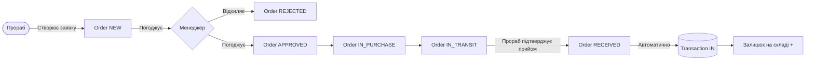
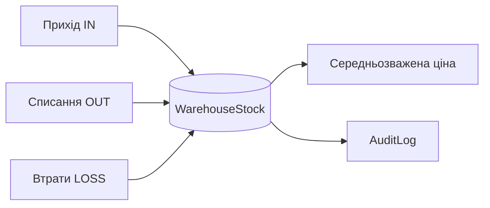

<div align="center">

# BuildFlow ERP

**Система управління закупівлями та складом для будівельних компаній**

[](https://python.org)
[](https://djangoproject.com)
[](https://postgresql.org)
[](https://getbootstrap.com)
[](LICENSE)

Повний цикл від заявки на матеріали до їх списання на об'єкті —\
без Excel-таблиць, без дзвінків, без втрат.

[Швидкий старт](#-швидкий-старт) · [Архітектура](#-архітектура) · [API](#-api-endpoints) · [Деплой](#-production-deployment)

</div>

---

## Зміст

- [Про проект](#-про-проект)
- [Можливості](#-можливості)
- [Технічний стек](#-технічний-стек)
- [Швидкий старт](#-швидкий-старт)
- [Конфігурація](#-конфігурація)
- [Архітектура](#-архітектура)
- [Моделі даних](#-моделі-даних)
- [Ролі користувачів](#-ролі-користувачів)
- [API Endpoints](#-api-endpoints)
- [Production Deployment](#-production-deployment)
- [Тестування](#-тестування)
- [Безпека](#-безпека)

---

## Про проект

BuildFlow ERP автоматизує матеріальний облік на будівельному підприємстві: прораб створює заявку з телефону, менеджер погоджує в один клік, система відстежує вантаж і списує матеріали на потрібний етап будівництва. Повна прозорість витрат без зайвих дзвінків та паперів.

**Що вирішує система:**

| Проблема | Рішення |
|----------|---------|
| Заявки через Viber/Telegram — губляться | Єдиний журнал заявок зі статусами |
| Не зрозуміло що де лежить на складі | Залишки в реальному часі по кожному об'єкту |
| Прораб списав більше ніж привезли | Транзакції прив'язані до накладних |
| Excel-звіти вручну щомісяця | Автоматичні звіти + експорт в Excel |

---

## Можливості

### Управління заявками
- Створення заявок на закупівлю з мобільного
- Багаторівневе погодження: прораб → менеджер
- Автоматичне розділення заявки по постачальниках
- Статуси: `нова` → `погоджена` → `в закупівлі` → `в дорозі` → `прийнята`
- Коментарі та чат всередині заявки
- Прикріплення фото та документів

### Складський облік
- Залишки по кожному складу / об'єкту в реальному часі
- Типи транзакцій: прихід, списання, втрати, переміщення між складами
- Автоматичний розрахунок середньозваженої собівартості
- Повна історія руху кожного матеріалу

### Логістика
- Дані водія та транспортного засобу
- Відстеження вантажу з мобільного
- Друк ТТН (товарно-транспортних накладних)
- Підтвердження прийому з фотофіксацією

### Аналітика
- Залишки по складах
- Оборотна відомість
- Списання та втрати в розрізі об'єктів
- Рейтинг постачальників
- Аналіз витрат по етапах будівництва
- Фінансові звіти з експортом в Excel

---

## Технічний стек

| Шар | Технологія | Призначення |
|-----|-----------|-------------|
| Backend | Django 5.0, Python 3.11+ | Бізнес-логіка, ORM, Auth |
| Database | PostgreSQL 14+ | Основне сховище даних |
| Frontend | Bootstrap 5, Vanilla JS | UI, адаптивна верстка |
| Charts | Chart.js | Аналітичні дашборди |
| Static Files | WhiteNoise | Роздача статики без nginx |
| WSGI | Gunicorn | Production-сервер |
| Images | Pillow | Обробка фото-вкладень |
| Excel | openpyxl | Генерація звітів |
| Config | python-dotenv | Управління оточенням |

---

## Швидкий старт

### Передумови

- Python 3.11+
- PostgreSQL 14+
- Git

### Встановлення

```bash
# 1. Клонування репозиторію
git clone https://github.com/andre20122002/construction-crm.git
cd construction-crm

# 2. Віртуальне оточення
python -m venv venv
source venv/bin/activate        # Linux / macOS
# venv\Scripts\activate         # Windows

# 3. Залежності
pip install -r requirements.txt

# 4. Конфігурація середовища
cp .env.example .env
# Відредагуйте .env: встановіть DB_PASSWORD та DJANGO_SECRET_KEY
```

### Запуск бази та міграцій

```bash
# Створіть БД (якщо ще не існує)
createdb warehouse_db

# Застосуйте міграції
python manage.py migrate

# Завантажте демо-дані (опційно)
python manage.py seed_data
```

### Запуск сервера

```bash
python manage.py runserver
```

Відкрийте [http://127.0.0.1:8000](http://127.0.0.1:8000)

> **Стандартний обліковий запис після seed_data:**
> Логін та пароль вказані у виводі команди `seed_data`.

---

## Конфігурація

Всі налаштування передаються через файл `.env`. Скопіюйте `.env.example` і заповніть потрібні значення.

```dotenv
# ── Середовище ────────────────────────────────────────────
DJANGO_ENV=development          # development | production
DJANGO_DEBUG=True
DJANGO_SECRET_KEY=your-secret-key-here
DJANGO_ALLOWED_HOSTS=127.0.0.1,localhost

# ── База даних ────────────────────────────────────────────
DB_ENGINE=django.db.backends.postgresql
DB_NAME=warehouse_db
DB_USER=postgres
DB_PASSWORD=your-db-password
DB_HOST=localhost
DB_PORT=5432

# ── Email (production) ────────────────────────────────────
# EMAIL_HOST=smtp.gmail.com
# EMAIL_PORT=587
# EMAIL_USE_TLS=True
# EMAIL_HOST_USER=your@email.com
# EMAIL_HOST_PASSWORD=app-password

# ── Кеш (production, опційно) ─────────────────────────────
# CACHE_BACKEND=django.core.cache.backends.redis.RedisCache
# CACHE_LOCATION=redis://127.0.0.1:6379/1

# ── Логування ─────────────────────────────────────────────
DJANGO_LOG_LEVEL=DEBUG          # DEBUG | INFO | WARNING | ERROR
```

Згенерувати `DJANGO_SECRET_KEY`:

```bash
python -c "from django.core.management.utils import get_random_secret_key; print(get_random_secret_key())"
```

---

## Архітектура

```
construction_crm/              # Django project (конфігурація)
├── settings.py                # Environment-aware налаштування
├── urls.py                    # Кореневий URL-роутинг + /health/
└── wsgi.py                    # WSGI application

warehouse/                     # Основний застосунок
├── models.py                  # Моделі: Order, Material, Transaction, …
├── forms.py                   # Форми з валідацією
├── decorators.py              # @staff_required, @rate_limit
├── services/
│   └── inventory.py           # Бізнес-логіка складу
├── views/
│   ├── general.py             # Dashboard, профіль
│   ├── manager.py             # Менеджерський розділ
│   ├── orders.py              # CRUD заявок
│   ├── transactions.py        # Складські операції
│   ├── reports.py             # Звіти та аналітика
│   └── utils.py               # Хелпери, AJAX-ендпоінти
└── templates/                 # 44 HTML-шаблони (Bootstrap 5)
```

### Потік заявки



### Складська операція



---

## Моделі даних

```
Warehouse (Склад / Об'єкт)
    ├── WarehouseStock          залишки по матеріалах
    ├── Order                   заявки на закупівлю
    ├── ConstructionStage       етапи будівництва
    └── UserProfile.warehouses  доступ користувачів

Order (Заявка)
    ├── OrderItem               позиції (матеріал + кількість + ціна)
    ├── OrderComment            коментарі / чат
    └── Transaction             створюється при прийомі товару

Material (Матеріал)
    ├── Category                категорія
    ├── SupplierPrice           прайс постачальників
    └── Transaction             повна історія руху

Transaction (Рух матеріалу)
    ├── type: IN | OUT | LOSS
    ├── transfer_group_id       зв'язок пари переміщень
    └── AuditLog                хто / коли / що змінив
```

---

## Ролі користувачів

| Можливість | Менеджер (`is_staff`) | Прораб |
|------------|:-------------------:|:------:|
| Всі склади та заявки | + | - (тільки свої) |
| Погодження / відхилення заявок | + | - |
| Управління довідниками | + | - |
| Всі звіти та аналітика | + | - |
| Контроль бюджетів | + | - |
| Створення заявок | + | + |
| Підтвердження прийому товару | + | + |
| Списання матеріалів на роботи | + | + |
| Мобільний інтерфейс | + | + |

---

## API Endpoints

| Endpoint | Метод | Опис | Auth |
|----------|-------|------|------|
| `GET /health/` | GET | Health check для load balancer | Ні |
| `/ajax/materials/` | GET | Пошук матеріалів (autocomplete) | Session |
| `/ajax/warehouse/<id>/stock/` | GET | Залишки по складу | Session |
| `/ajax/load-stages/` | GET | Етапи будівництва для select | Session |

### Приклад відповіді `/health/`

```json
{
  "status": "healthy",
  "database": "ok"
}
```

### Приклад відповіді `/ajax/warehouse/<id>/stock/`

```json
[
  {
    "material_id": 42,
    "material_name": "Цемент М400",
    "unit": "кг",
    "quantity": 1500.0,
    "avg_price": 4.75
  }
]
```

> AJAX-ендпоінти захищені rate limiting: 30–120 запитів/хв залежно від типу.

---

## Production Deployment

### Системні вимоги

- Python 3.11+
- PostgreSQL 14+
- Gunicorn (входить у `requirements.txt`)
- Nginx або інший reverse proxy (рекомендовано)
- Redis (опційно, для кешування при масштабуванні)

### .env для production

```dotenv
DJANGO_ENV=production
DJANGO_DEBUG=False
DJANGO_SECRET_KEY=<згенерований-ключ>
DJANGO_ALLOWED_HOSTS=yourdomain.com
CSRF_TRUSTED_ORIGINS=https://yourdomain.com

DB_PASSWORD=<strong-password>

DJANGO_SECURE_SSL_REDIRECT=True
DJANGO_SECURE_HSTS_SECONDS=31536000
```

### Деплой

```bash
# Збір статики
python manage.py collectstatic --noinput

# Міграції
python manage.py migrate --run-syncdb

# Запуск Gunicorn
gunicorn construction_crm.wsgi:application \
  --bind 0.0.0.0:8000 \
  --workers 4 \
  --timeout 120 \
  --access-logfile -
```

### Мінімальна конфігурація Nginx

```nginx
server {
    listen 80;
    server_name yourdomain.com;
    return 301 https://$host$request_uri;
}

server {
    listen 443 ssl;
    server_name yourdomain.com;

    location / {
        proxy_pass http://127.0.0.1:8000;
        proxy_set_header Host $host;
        proxy_set_header X-Real-IP $remote_addr;
        proxy_set_header X-Forwarded-For $proxy_add_x_forwarded_for;
        proxy_set_header X-Forwarded-Proto $scheme;
    }

    location /static/ {
        alias /path/to/project/staticfiles/;
    }

    location /media/ {
        alias /path/to/project/media/;
    }
}
```

### Перевірка після деплою

```bash
curl https://yourdomain.com/health/
# {"status": "healthy", "database": "ok"}
```

---

## Тестування

```bash
# Всі тести
python manage.py test

# Конкретний модуль
python manage.py test warehouse.tests.InventoryServiceTests

# З виводом деталей
python manage.py test --verbosity=2
```

**Покриття тестів:** 26 тестів

| Область | Тести |
|---------|-------|
| `InventoryService` | Прихід, списання, розрахунок середньої ціни |
| Переміщення | Пара транзакцій, group_id |
| Контроль доступу | Прораб не бачить чужі склади |
| AJAX-ендпоінти | Пошук матеріалів, залишки |

---

## Безпека

| Механізм | Реалізація |
|----------|-----------|
| Автентифікація | Django session-based auth |
| Авторизація | Role-based (`is_staff`) + warehouse-level ACL |
| CSRF | Увімкнено, `CSRF_TRUSTED_ORIGINS` обов'язковий у production |
| XSS | Django template auto-escaping (за замовчуванням) |
| SQL Injection | Тільки ORM, без raw queries |
| Rate Limiting | 30–120 req/хв на AJAX-ендпоінтах (`@rate_limit`) |
| Завантаження файлів | Ліміт 10 МБ, whitelist розширень |
| Аудит | `AuditLog` з IP-адресою на кожну зміну |
| HSTS | Налаштовується через `DJANGO_SECURE_HSTS_SECONDS` |

---

<div align="center">

**Author:** Andrij Danilchuk &nbsp;·&nbsp; [GitHub]https://github.com/cs-kpnu/build-flow)

</div>
