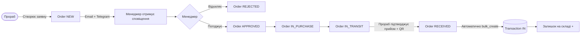
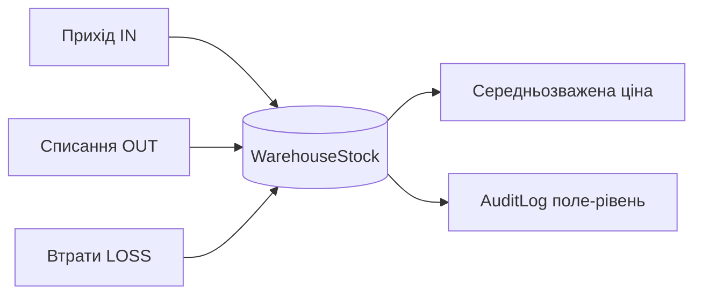

<div align="center">

# Budsklad ERP

**Система управління закупівлями та складом для будівельних компаній**

[](https://python.org)
[](https://djangoproject.com)
[](https://postgresql.org)
[](https://getbootstrap.com)
[](#-тестування)
[](LICENSE)

Повний цикл від заявки на матеріали до їх списання на об'єкті —\
без Excel-таблиць, без дзвінків, без втрат.

[Швидкий старт](#-швидкий-старт) · [Архітектура](#-архітектура) · [API](#-api-endpoints) · [Деплой](#-production-deployment)

</div>

---

## Зміст

- [Про проект](#-про-проект)
- [Можливості](#-можливості)
- [Технічний стек](#-технічний-стек)
- [Швидкий старт](#-швидкий-старт)
- [Конфігурація](#-конфігурація)
- [Архітектура](#-архітектура)
- [Моделі даних](#-моделі-даних)
- [Ролі користувачів](#-ролі-користувачів)
- [Management Commands](#-management-commands)
- [API Endpoints](#-api-endpoints)
- [Production Deployment](#-production-deployment)
- [Тестування](#-тестування)
- [Безпека](#-безпека)

---

## Про проект

Budsklad ERP автоматизує матеріальний облік на будівельному підприємстві: прораб створює заявку з телефону, менеджер погоджує в один клік, система відстежує вантаж і списує матеріали на потрібний етап будівництва. Повна прозорість витрат без зайвих дзвінків та паперів.

**Що вирішує система:**

| Проблема | Рішення |
|----------|---------|
| Заявки через Viber/Telegram — губляться | Єдиний журнал заявок зі статусами та сповіщеннями |
| Не зрозуміло що де лежить на складі | Залишки в реальному часі по кожному об'єкту |
| Прораб списав більше ніж привезли | Транзакції прив'язані до накладних + QR-сканер |
| Excel-звіти вручну щомісяця | Автоматичні звіти + експорт в Excel |
| Хто і коли що змінив — невідомо | Поле-рівневий audit log на кожну зміну |

---

## Можливості

### Управління заявками
- Створення заявок на закупівлю з мобільного
- Багаторівневе погодження: прораб → менеджер → логіст
- Автоматичне розділення заявки по постачальниках
- Статуси: `нова` → `погоджена` → `в закупівлі` → `в дорозі` → `прийнята`
- Email та Telegram сповіщення при зміні статусу заявки
- М'яке видалення (кошик) — заявки та транзакції не втрачаються
- Коментарі та чат всередині заявки
- Прикріплення фото та документів
- Виявлення дублікатів при створенні

### Складський облік
- Залишки по кожному складу / об'єкту в реальному часі
- Типи транзакцій: прихід, списання, втрати, переміщення між складами
- Автоматичний розрахунок середньозваженої собівартості
- Повна історія руху кожного матеріалу
- QR / штрих-код сканер при прийомі товару
- Масовий імпорт матеріалів через Excel (.xlsx)

### Аудит та прозорість
- Поле-рівневий audit log: фіксує старе та нове значення кожного поля
- Логування IP, користувача, часу на кожну зміну
- Відстеження невдалих спроб входу

### Аналітика
- Залишки по складах
- Оборотна відомість
- Списання та втрати в розрізі об'єктів
- Рейтинг постачальників
- Аналіз витрат по бетону, арматурі, механізмах
- Фінансові звіти з експортом в Excel

---

## Технічний стек

| Шар | Технологія | Призначення |
|-----|-----------|-------------|
| Backend | Django 5.0, Python 3.11+ | Бізнес-логіка, ORM, Auth |
| Database | PostgreSQL 14+ | Основне сховище даних |
| Cache | Redis / LocMem (dev) | Кешування lookups, rate limiting |
| Frontend | Bootstrap 5, Vanilla JS | UI, адаптивна верстка |
| Charts | Chart.js | Аналітичні дашборди |
| QR | qrcode + html5-qrcode | Сканування та генерація QR кодів |
| Static Files | WhiteNoise | Роздача статики без nginx |
| WSGI | Gunicorn | Production-сервер |
| Images | Pillow | Обробка фото-вкладень |
| Excel | openpyxl | Генерація звітів та імпорт |
| Notifications | smtplib + Telegram Bot API | Email та Telegram сповіщення |
| Config | python-dotenv | Управління оточенням |

---

## Швидкий старт

### Передумови

- Python 3.11+
- PostgreSQL 14+
- Git
- Redis (опційно, для кешування; у dev режимі використовується LocMemCache)

### Встановлення

```bash
# 1. Клонування репозиторію
git clone https://github.com/cs-kpnu/build-flow.git
cd build-flow

# 2. Віртуальне оточення
python -m venv venv
source venv/bin/activate        # Linux / macOS
# venv\Scripts\activate         # Windows

# 3. Залежності
pip install -r requirements.txt

# 4. Конфігурація середовища
cp .env.example .env
# Відредагуйте .env: встановіть DB_PASSWORD та DJANGO_SECRET_KEY
```

### Запуск бази та міграцій

```bash
# Створіть БД (якщо ще не існує)
createdb warehouse_db

# Застосуйте міграції
python manage.py migrate

# Ініціалізація ролей та прав доступу
python manage.py init_rbac

# Завантажте демо-дані (опційно)
python manage.py seed_data
```

### Запуск сервера

```bash
python manage.py runserver
```

Відкрийте [http://127.0.0.1:8000](http://127.0.0.1:8000)

> **Стандартний обліковий запис після seed_data:**
> Логін та пароль вказані у виводі команди `seed_data`.

---

## Конфігурація

Всі налаштування передаються через файл `.env`. Скопіюйте `.env.example` і заповніть потрібні значення.

```dotenv
# ── Середовище ────────────────────────────────────────────
DJANGO_ENV=development          # development | production
DJANGO_DEBUG=True
DJANGO_SECRET_KEY=your-secret-key-here
DJANGO_ALLOWED_HOSTS=127.0.0.1,localhost

# ── База даних ────────────────────────────────────────────
DB_ENGINE=django.db.backends.postgresql
DB_NAME=warehouse_db
DB_USER=postgres
DB_PASSWORD=your-db-password
DB_HOST=localhost
DB_PORT=5432

# ── Кеш ──────────────────────────────────────────────────
# Dev: LocMemCache (за замовчуванням, нічого не потрібно)
# Prod: Redis
# CACHE_BACKEND=django.core.cache.backends.redis.RedisCache
# CACHE_LOCATION=redis://127.0.0.1:6379/1

# ── Email (production) ────────────────────────────────────
# EMAIL_HOST=smtp.gmail.com
# EMAIL_PORT=587
# EMAIL_USE_TLS=True
# EMAIL_HOST_USER=your@email.com
# EMAIL_HOST_PASSWORD=app-password

# ── Telegram сповіщення ───────────────────────────────────
# TELEGRAM_BOT_TOKEN=your-bot-token
# TELEGRAM_CHAT_ID=your-chat-id

# ── Безпека (production) ──────────────────────────────────
DJANGO_SECURE_SSL_REDIRECT=False
DJANGO_SECURE_HSTS_SECONDS=0
# DJANGO_CSP_REPORT_ONLY=False
# DJANGO_CSP_EXTRA=

# ── Логування ─────────────────────────────────────────────
DJANGO_LOG_LEVEL=DEBUG          # DEBUG | INFO | WARNING | ERROR
```

Згенерувати `DJANGO_SECRET_KEY`:

```bash
python -c "from django.core.management.utils import get_random_secret_key; print(get_random_secret_key())"
```

---

## Архітектура

```
construction_crm/              # Django project (конфігурація)
├── settings.py                # Environment-aware налаштування
├── urls.py                    # Кореневий URL-роутинг + /health/
└── wsgi.py                    # WSGI application

warehouse/                     # Основний застосунок
├── models.py                  # Моделі: Order, Material, Transaction, …
├── forms.py                   # Форми з валідацією
├── decorators.py              # @staff_required, @rate_limit
├── middleware.py              # CSPMiddleware (Content-Security-Policy)
├── signals.py                 # Audit log, сповіщення при зміні статусу
├── services/
│   ├── inventory.py           # Бізнес-логіка складу (batch bulk_create)
│   ├── notifications.py       # Email + Telegram сповіщення
│   └── excel_utils.py         # Централізована генерація Excel звітів
├── views/
│   ├── auth.py                # Rate-limited login (10 спроб / 5 хв)
│   ├── general.py             # Dashboard, профіль
│   ├── manager.py             # Менеджерський розділ
│   ├── orders.py              # CRUD заявок, QR-сканер, Excel-імпорт
│   ├── transactions.py        # Складські операції
│   ├── reports.py             # Звіти та аналітика
│   ├── concrete_analytics.py  # Аналіз витрат по бетону
│   ├── rebar_analytics.py     # Аналіз по арматурі
│   ├── mechanisms_analytics.py# Аналіз по механізмах
│   └── utils.py               # Хелпери, AJAX-ендпоінти
├── management/commands/
│   ├── seed_data.py           # Генерація демо-даних
│   ├── init_rbac.py           # Ініціалізація ролей та прав доступу
│   └── cleanup_transactions.py# Архівування / очищення старих транзакцій
└── templates/                 # 44 HTML-шаблони (Bootstrap 5)
```

### Потік заявки



### Складська операція



---

## Моделі даних

```
Warehouse (Склад / Об'єкт)
    ├── WarehouseStock          залишки по матеріалах
    ├── Order                   заявки на закупівлю
    ├── ConstructionStage       етапи будівництва
    └── UserProfile.warehouses  доступ користувачів

Order (Заявка)
    ├── OrderItem               позиції (матеріал + кількість + ціна)
    │   └── material FK         PROTECT — неможливо видалити матеріал з активними позиціями
    ├── OrderComment            коментарі / чат
    ├── Transaction             створюється при прийомі товару (bulk_create)
    ├── is_deleted / deleted_at м'яке видалення (кошик)
    └── deleted_by              хто видалив

Material (Матеріал)
    ├── Category                категорія
    ├── SupplierPrice           прайс постачальників
    │   └── idx: (supplier, material)
    └── Transaction             повна історія руху

Transaction (Рух матеріалу)
    ├── type: IN | OUT | LOSS
    ├── material FK             PROTECT
    ├── warehouse FK            PROTECT
    ├── transfer_group_id       зв'язок пари переміщень
    ├── is_deleted / deleted_at м'яке видалення
    └── AuditLog                хто / коли / що змінив (старе → нове значення)
```

---

## Ролі користувачів

Система використовує два рівні доступу:
- **`is_staff`** — основний перемикач менеджер / прораб
- **Django Groups** (Manager / Logistics / Foreman / Finance) — тонке налаштування через Permission system

| Можливість | Manager | Logistics | Foreman | Finance |
|------------|:-------:|:---------:|:-------:|:-------:|
| Всі склади та заявки | + | перегляд | свої | перегляд |
| Погодження / відхилення заявок | + | - | - | - |
| Зміна статусу (transit) | + | + | - | - |
| Управління довідниками | + | - | - | - |
| Всі звіти та аналітика | + | - | - | + |
| Контроль бюджетів | + | - | - | - |
| Створення заявок | + | - | + | - |
| Підтвердження прийому товару | + | - | + | - |
| Списання матеріалів | + | - | + | - |

Ініціалізація груп:
```bash
python manage.py init_rbac
```

---

## Management Commands

### `seed_data`
Генерує демо-дані: склади, матеріали, заявки, транзакції, постачальники.
```bash
python manage.py seed_data
```

### `init_rbac`
Ініціалізує групи та Django permissions для 4 ролей (Manager, Logistics, Foreman, Finance).
```bash
python manage.py init_rbac
```

### `cleanup_transactions`
Архівує або видаляє старі транзакції.
```bash
# Перегляд без змін
python manage.py cleanup_transactions --days=365 --dry-run

# М'яке видалення (is_deleted=True)
python manage.py cleanup_transactions --days=365 --soft-delete

# Фізичне видалення (вимагає підтвердження)
python manage.py cleanup_transactions --days=730 --hard-delete --confirm

# Фільтрація по типу та складу
python manage.py cleanup_transactions --days=365 --type=LOSS --warehouse=3
```
Транзакції, прив'язані до активних заявок (new/approved/purchasing/transit), не видаляються.

---

## API Endpoints

| Endpoint | Метод | Опис | Auth |
|----------|-------|------|------|
| `GET /health/` | GET | Health check для load balancer | Ні |
| `/ajax/materials/` | GET | Пошук матеріалів (autocomplete) | Session |
| `/ajax/warehouse/<id>/stock/` | GET | Залишки по складу | Session |
| `/ajax/load-stages/` | GET | Етапи будівництва для select | Session |

### Приклад відповіді `/health/`

```json
{
  "status": "healthy",
  "database": "ok"
}
```

### Приклад відповіді `/ajax/warehouse/<id>/stock/`

```json
[
  {
    "material_id": 42,
    "material_name": "Цемент М400",
    "unit": "кг",
    "quantity": 1500.0,
    "avg_price": 4.75
  }
]
```

> AJAX-ендпоінти захищені rate limiting: 30–120 запитів/хв залежно від типу.

---

## Production Deployment

### Системні вимоги

- Python 3.11+
- PostgreSQL 14+
- Gunicorn (входить у `requirements.txt`)
- Nginx або інший reverse proxy
- Redis (рекомендовано для кешування при масштабуванні)

### .env для production

```dotenv
DJANGO_ENV=production
DJANGO_DEBUG=False
DJANGO_SECRET_KEY=<згенерований-ключ>
DJANGO_ALLOWED_HOSTS=yourdomain.com
CSRF_TRUSTED_ORIGINS=https://yourdomain.com

DB_PASSWORD=<strong-password>

# HTTPS та HSTS
DJANGO_SECURE_SSL_REDIRECT=True
DJANGO_SECURE_HSTS_SECONDS=31536000

# Redis кеш
CACHE_BACKEND=django.core.cache.backends.redis.RedisCache
CACHE_LOCATION=redis://127.0.0.1:6379/1

# CSP (опційно, для дебагу)
# DJANGO_CSP_REPORT_ONLY=True
```

### Деплой

```bash
# Збір статики
python manage.py collectstatic --noinput

# Міграції
python manage.py migrate

# Ініціалізація ролей
python manage.py init_rbac

# Запуск Gunicorn
gunicorn construction_crm.wsgi:application \
  --bind 0.0.0.0:8000 \
  --workers 4 \
  --timeout 120 \
  --access-logfile -
```

### Мінімальна конфігурація Nginx

```nginx
server {
    listen 80;
    server_name yourdomain.com;
    return 301 https://$host$request_uri;
}

server {
    listen 443 ssl;
    server_name yourdomain.com;

    location / {
        proxy_pass http://127.0.0.1:8000;
        proxy_set_header Host $host;
        proxy_set_header X-Real-IP $remote_addr;
        proxy_set_header X-Forwarded-For $proxy_add_x_forwarded_for;
        proxy_set_header X-Forwarded-Proto $scheme;
    }

    location /static/ {
        alias /path/to/project/staticfiles/;
    }

    location /media/ {
        alias /path/to/project/media/;
    }
}
```

### Перевірка після деплою

```bash
curl https://yourdomain.com/health/
# {"status": "healthy", "database": "ok"}
```

---

## Тестування

```bash
# Всі тести
python manage.py test warehouse --noinput

# Конкретний модуль
python manage.py test warehouse.tests.test_inventory

# З виводом деталей
python manage.py test warehouse --verbosity=2
```

**Покриття тестів:** 302 тести

| Область | Опис |
|---------|------|
| `InventoryService` | Прихід, списання, bulk операції, середня ціна |
| Заявки | CRUD, статуси, розділення, дублікати |
| Транзакції | Переміщення, м'яке видалення, group_id |
| Soft-delete | Кошик для заявок і транзакцій, відновлення |
| Audit log | Поле-рівневий лог, diff старе → нове значення |
| QR / Excel імпорт | Сканування, парсинг xlsx, валідація |
| Сповіщення | Email, Telegram при зміні статусу |
| Контроль доступу | Прораб не бачить чужі склади, staff-only |
| AJAX-ендпоінти | Пошук матеріалів, залишки |
| Views / Reports | Звіти, фільтри, Excel-експорт |

---

## Безпека

| Механізм | Реалізація |
|----------|-----------|
| Автентифікація | Django session-based auth |
| Авторизація | Role-based (`is_staff`) + warehouse-level ACL + Django Groups |
| CSRF | Увімкнено, `CSRF_TRUSTED_ORIGINS` обов'язковий у production |
| XSS | Django template auto-escaping + Excel formula injection sanitization |
| SQL Injection | Тільки ORM, без raw queries |
| Content Security Policy | `CSPMiddleware` з allowlist CDN; `DJANGO_CSP_REPORT_ONLY` для дебагу |
| Rate Limiting (login) | 10 спроб / 5 хв на IP, повертає HTTP 429 |
| Rate Limiting (AJAX) | 30–120 req/хв на ендпоінтах (`@rate_limit`) |
| Referential Integrity | `on_delete=PROTECT` на критичних FK (Material, Warehouse у транзакціях) |
| Завантаження файлів | Ліміт 10 МБ, whitelist розширень |
| Аудит | `AuditLog` з IP, користувачем і дифом полів на кожну зміну |
| HSTS | `DJANGO_SECURE_HSTS_SECONDS=31536000` у production |
| SSL Redirect | `DJANGO_SECURE_SSL_REDIRECT=True` у production |

---

<div align="center">

**Author:** Andrii Danylchuk &nbsp;·&nbsp; [GitHub](https://github.com/cs-kpnu/build-flow)

</div>
